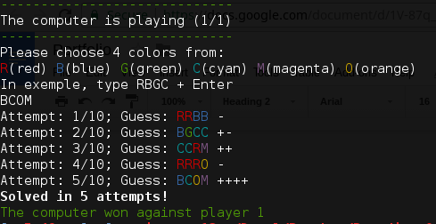

# 💎 MASTERMIND RUBY 💎

This implementation of the MasterMind game in Ruby allows a human to play against
another human or against the computer. The computer uses [Donald Knuth](https://en.wikipedia.org/wiki/Donald_Knuth)’s 5 guess algorithm to
break a code and is very hard to beat.

 

## Description

The program is divided in 3 files:
- Mastermind.rb : retrieve user input, generate random code, compare and
give feedback
- Solver.rb : implementation of Knuth's algorithm, using min max approach and
eliminating inconsistent codes
- Main.rb : defining prompt arguments and instantiating a new game depending on the user input

## Playing

`ruby Main.rb [options]`

### Options

```
--help, -h:
    show help and exit
--lenght, -l:
    Number of holes in the board (Type : Int; Range : [2..6]; Default : 4)
--colors, -c:
    Number of available colors (Type : Int; Range : [2..6]; Default : 6)
--games, -g:
    Number of game both player will play (Type : Int; Range : [1..10]; Default : 1)
--ia, -i:
    Choose to play against the computer instead of another human (Type : Bool; Range : [true, false]; Default : true)
--duplicates, -d:
    Decide if the code could contain duplicates (Type : Bool; Range : [true, false]; Default : true)
--attempts, -a:
    Maximum number of attempts to break the code (Type : Int; Range : [5..20]; Default : 10)
```


## Licence

This program has been designed as a part of the Paradigms of programing (P00400) assessment during my MSc in Software Engineering at Oxford Brookes University.

It is provided under the [MIT licence](https://github.com/MathersMax/mastermind-rb/blob/master/LICENSE).